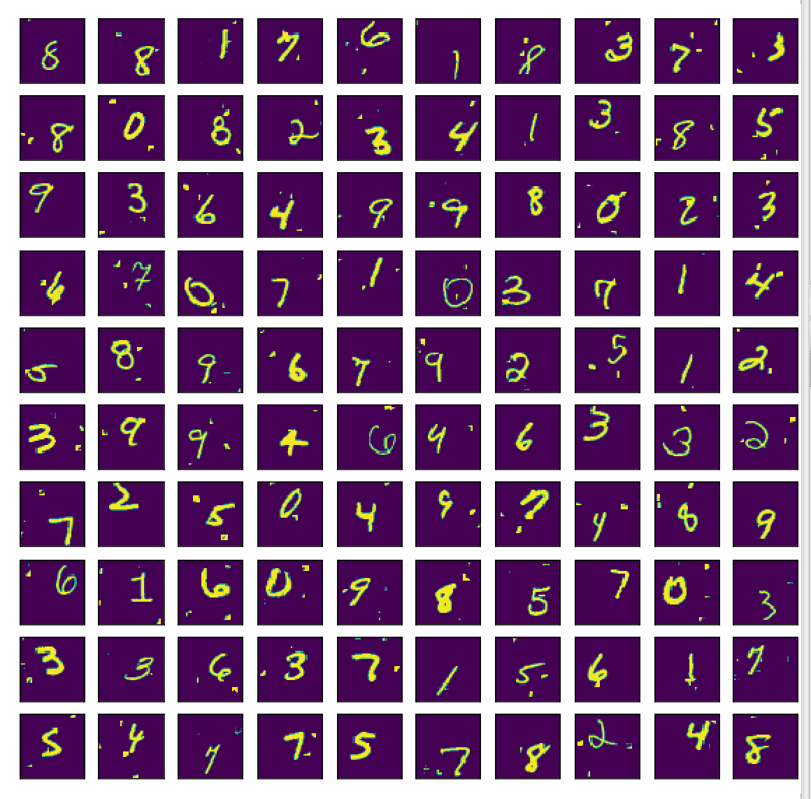
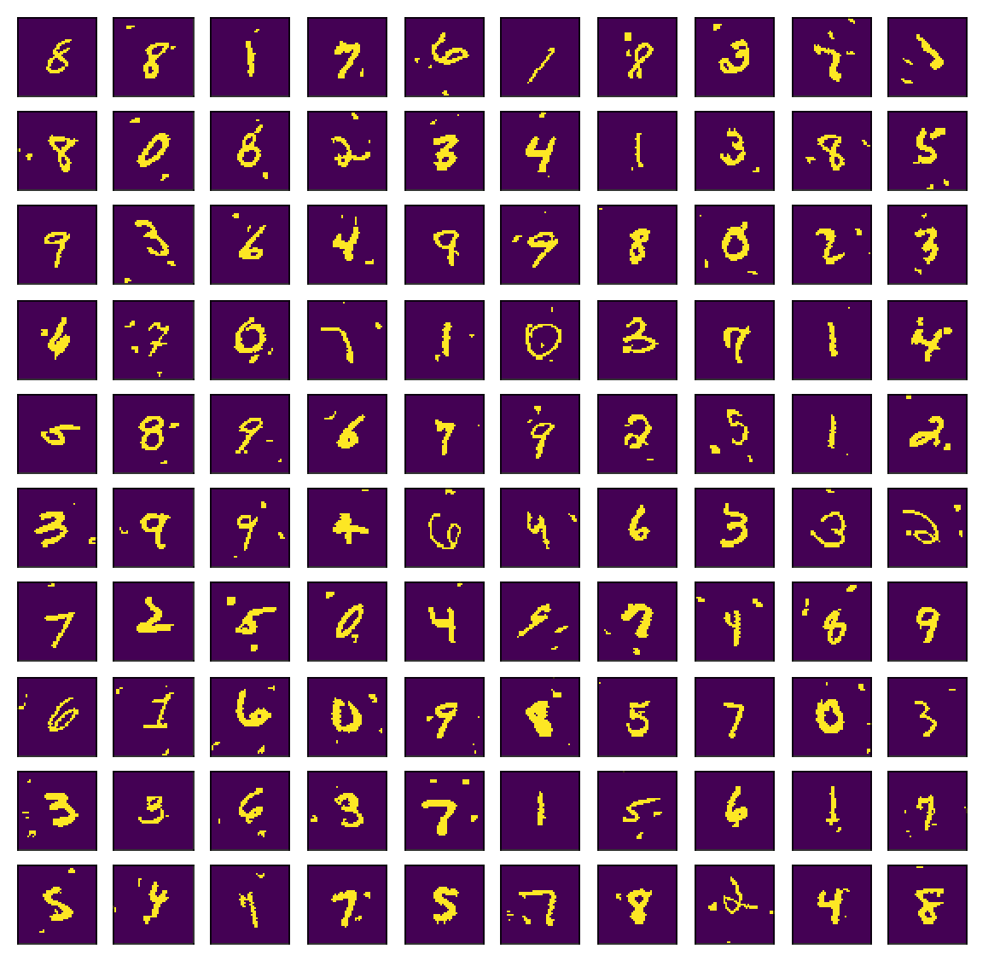
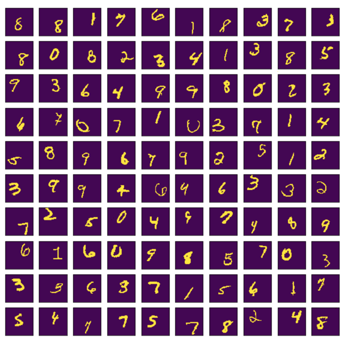
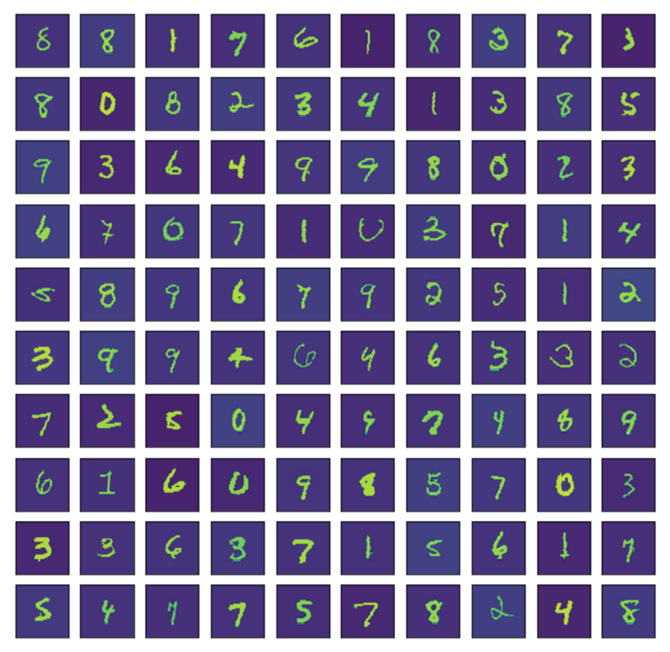
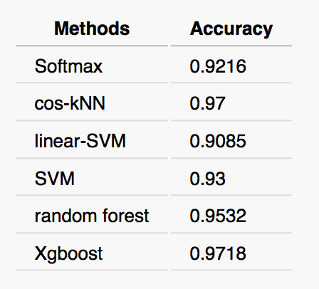
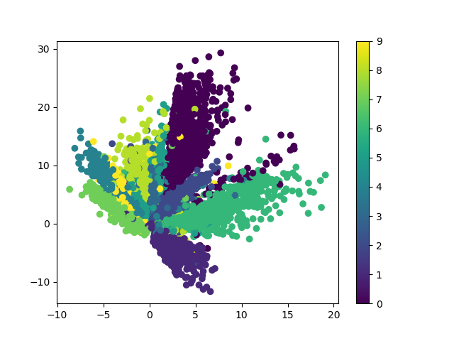
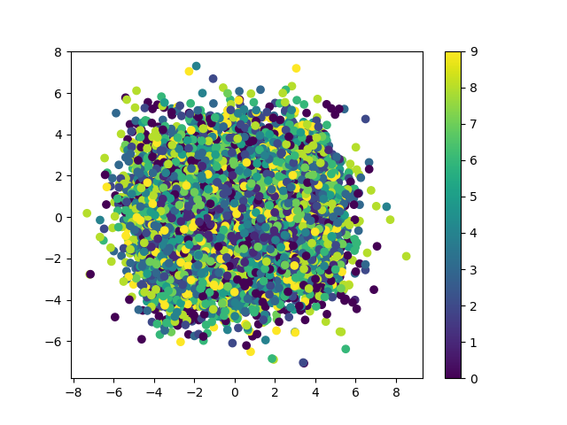
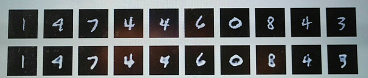

# CS420 Course Project

## An Exploratory Study on MNIST dataset


©[Chacha Chen](baidu.com)  
©[Yunyan Hong](https://github.com/hongyunyan)   
©[Yin Lin](https://github.com/niceIrene)

- Data Preprocessing
  - image deskewing 
  - noise reduction
- Classical Learning Method:
    - Softmax, kNN, SVM, Random forest, Xgboost
- Neural Networks:
  -  MLP, CNN, RNN, LSTM
- Unsupervise Learning:
  -  PCA , Autoencoder, k-Means


## Usage

- Proprecessing

```
cd dataset
./get_data.sh
```
This will automatically download MNIST data from [http://cmach.sjtu.edu.cn/course/cs420/projects/mnist.zip](http://cmach.sjtu.edu.cn/course/cs420/projects/mnist.zip)
and proprocessing the dataset, both deskewing and denoising, resulting in 6 dataset files in the dataset directory.

```
cd ..
python [technique_name]/[model_name].py
```

```
[technique_name] options:  classical_models,  NN_models
```

```
[model_name] options:

if classical_models: 	  softmax, knn, cos_knn, randomforest, xg_boost, SVM

if NN_models: 	 
  + CNN:  python keras_cnn.py -f=0 -n=30000 (-f 对应选择数据集，可选择0,1,2三个值，代表三个数据集，-n 对应训练的数据量，可以省略默认60000,下面均相同)
  + MLP:  python keras_MLP.py -f=0
  + RNN:  python keras_rnn.py -f=0
  + LSTM:  python keras_lstm.py -f=0
 ```


## Data Preprocessing





- The original polluted digits  
- Image deskewing 
- Noise Reduction
- Image deskewing + Noise reduction  

| Data Preprocessing       | Accuracy |
| ------------------------ | -------- |
| Original                 | 0.1337   |
| deskewed                 | 0.6145   |
| deskewed + noise reduced | 0.9194   |

## Classical Models



### Softmax with learning rate = 0.01
Accuracy: 0.1370  
Accuracy (standard): 0.2559  
Accuracy (deskewd): 0.6401  
Accuracy (deskewd + standard): 0.7170  
Accuracy (deskewd+reduced noise): 0.9113  
Accuracy (deskewd+reduced noise+standard): 0.9198  
Accuracy (deskewd+reduced noise+standard+pca): 0.9199

### Random Forest
random forest accuracy:  0.6919  
random forest accuracy (standard):  0.6465  
random forest accuracy with dekewed data:  0.8292  
random forest accuracy with dekewed+standard data:  0.8344  
random forest accuracy with dekewed + reduced noise data:  0.9532  
random forest accuracy with dekewed+ reduced noise + standard data:  0.5347

### linear SVM with SGD
stochastic gradient descent accuracy:  0.1359   
stochastic gradient descent accuracy with standard data:  0.2186   
stochastic gradient descent accuracy with deskewed data:  0.5942   
stochastic gradient descent accuracy with deskewed + standard data:  0.7171   
stochastic gradient descent accuracy with deskewed + reduced noise :  0.904   
stochastic gradient descent accuracy with deskewed + reduced noise +standard:  0.9081


	
	
	

=======
​	
​	
​	


<!--##  softmax
### learning rate = 10
Accuracy: 0.1497  
Accuracy (deskewd): 0.6219  
Accuracy (deskewd+reduced noise): 0.8995

### learning rate = 1
Accuracy: 0.1262  
Accuracy (deskewd): 0.6452  
Accuracy (deskewd+reduced noise): 0.9118

### learning rate = 0.5
- Accuracy: 0.1337
- Accuracy (deskewd): 0.6145
- Accuracy (deskewd+reduced noise): 0.9194

### learning rate = 0.1
Accuracy: 0.1398  
Accuracy (deskewd): 0.6179  
Accuracy (deskewd+reduced noise): 0.9216

### learning rate = 0.01
Accuracy: 0.1370  
Accuracy (deskewd): 0.6401  
Accuracy (deskewd+reduced noise): 0.9113

### learning rate = 0.001
Accuracy: 0.1333  
Accuracy (standard): 0.2736  
Accuracy (deskewd): 0.5876  
Accuracy (deskewd + standard): 0.7233  
Accuracy (deskewd+reduced noise): 0.8820  
Accuracy (deskewd+reduced noise+standard): 0.9080

### learning rate = 0.01
Accuracy: 0.1370  
Accuracy (standard): 0.2559  
Accuracy (deskewd): 0.6401  
Accuracy (deskewd + standard): 0.7170  
Accuracy (deskewd+reduced noise): 0.9113  
Accuracy (deskewd+reduced noise+standard): 0.9198  
Accuracy (deskewd+reduced noise+standard+pca): 0.9199

### learning rate = 0.1
Accuracy: 0.1398  
Accuracy (standard): 0.1993  
Accuracy (deskewd): 0.6179  
Accuracy (deskewd + standard): 0.6500  
Accuracy (deskewd+reduced noise): 0.9216  
Accuracy (deskewd+reduced noise+standard): 0.9107  
Accuracy (deskewd+reduced noise+standard+pca): 0.9191

##  random-forest
random forest accuracy:  0.6919  
random forest accuracy (standard):  0.6465  
random forest accuracy with dekewed data:  0.8292  
random forest accuracy with dekewed+standard data:  0.8344  
random forest accuracy with dekewed + reduced noise data:  0.9532  
random forest accuracy with dekewed+ reduced noise + standard data:  0.5347


##  linear-svm with SGD

stochastic gradient descent accuracy:  0.1359   
stochastic gradient descent accuracy with standard data:  0.2186   
stochastic gradient descent accuracy with deskewed data:  0.5942   
stochastic gradient descent accuracy with deskewed + standard data:  0.7171   
stochastic gradient descent accuracy with deskewed + reduced noise :  0.904   
stochastic gradient descent accuracy with deskewed + reduced noise +standard:  0.9081

##  linear-svm 


## cos_knn


<!--
one epoch = one forward pass and one backward pass of all the training examples

batch size = the number of training examples in one forward/backward pass. The higher the batch size, the more memory space you'll need.

number of iterations = number of passes, each pass using [batch size] 

number of examples. To be clear, one pass = one forward pass + one backward pass (we do not count the forward pass and backward pass as two different passes).

Example: if you have 1000 training examples, and your batch size is 500, then it will take 2 iterations to complete 1 epoch.-->

## NN models

| Neural Networks | Performance | Running time |
| --------------- | ----------- | ------------ |
| MLP             | 98.41%      | 97s          |
| CNN             | 98.97%      | 8517s        |
| RNN             | 96.66%      | 490s         |
| LSTM            | 98.69%      | 801s         |

## unsupervised learning
### auto encoder (AE)

- The dimension reduction result of AE  
- The dimension reduction result of PCA

### dimension reduction + SVM result
|        | AE(2D) | PCA(2D |
| :----- | :----: | -----: |
| ACC    |  0.89  |   0.14 |
| Recall |  0.89  |   0.15 |

### auto encoder for data preprocessing result
| 45*45 original features | 45 *45 original features + 64ae | 64ae |
| ----------------------- | :-----------------------------: | ---: |
| 0.87                    |              0.89               | 0.70 |
| 0.97                    |              0.96               | 0.86 |
| 0.89                    |              0.87               | 0.79 |

### decode result of AE


